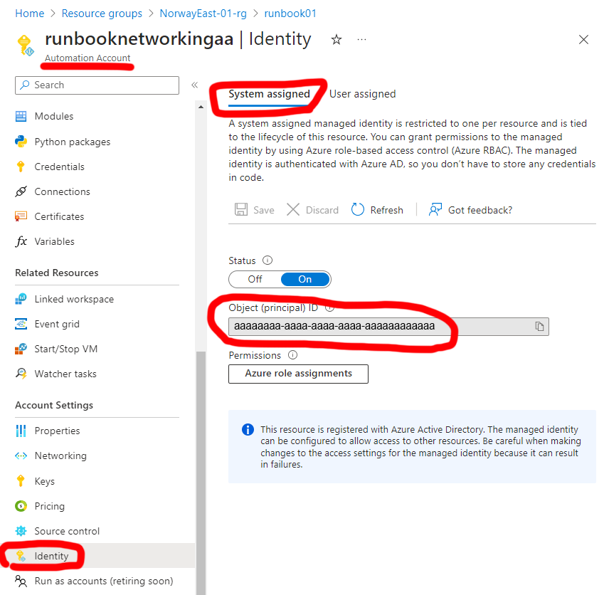

# Graph API permission to managed identity

## Find the object id for your Managed Identity
You can find the object id for your managed identity in the Azure Portal.
- Go to your automation account
- Click "identity" from the menu list to the left
- Copy the ObjectID

## Assign the permissions
In the [code](graph-api-permission-to-managed-identity.ps1), set the '$ManagedIdentityId' variable to the ObjectID for your managed identity.

You must be Global Admin to give permissions.